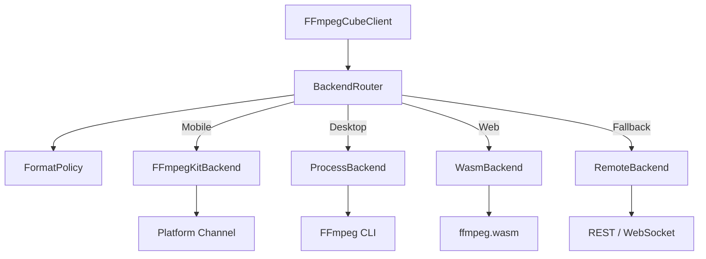

# FFmpeg Cube

<p align="center">
  <strong>Cross-platform Audio/Video Processing & Playback SDK for Flutter</strong>
</p>

<p align="center">
  <a href="https://pub.dev/packages/ffmpeg_cube"></a>
  <a href="https://github.com/ImL1s/ffmpeg_cube/actions"></a>
  <a href="https://opensource.org/licenses/BSD-3-Clause"></a>
</p>

[English](#english) | [中文](#中文)

---

<a name="english"></a>
## English

Supports **Android**, **iOS**, **macOS**, **Windows**, **Linux**, and **Web**.

### ✨ Features

#### 🎬 Media Processing
| Feature | Description | Example |
|---------|-------------|---------|
| **Transcode** | Convert formats, codecs | MP4 → WebM, H.264 → H.265 |
| **Trim** | Cut video by time range | Extract 00:30 - 02:00 |
| **Concat** | Merge multiple videos | Join intro, main content, outro |
| **Thumbnail** | Extract static images | Generate preview cover |
| **Subtitle** | Embed hard/soft subtitles | SRT/ASS embedding |
| **Audio** | Extract audio, mix tracks | Background music mixing |

#### 🎮 Playback
- **Unified Interface**: Powered by `media_kit`.
- **Streaming**: Supports local files and HTTP/HTTPS URLs.

#### 🧠 Smart Features
- **Format Policy**: Auto-selects best codec parameters based on platform.
- **Backend Router**: Auto-selects FFmpegKit / Process / Wasm backend.
- **Progress Callback**: Real-time progress tracking.

### 📦 Installation

```yaml
dependencies:
  ffmpeg_cube: ^0.1.3
  # media_kit is required for playback
  media_kit: ^1.1.10
  media_kit_video: ^1.2.4
```

<details>
<summary><b>Platform Specific Dependencies</b></summary>

**Android / iOS / macOS**
```yaml
dependencies:
  media_kit_libs_android_video: ^1.3.6
  media_kit_libs_ios_video: ^1.1.4
  media_kit_libs_macos_video: ^1.1.4
```

**Windows / Linux**
```yaml
dependencies:
  media_kit_libs_windows_video: ^1.0.9
  media_kit_libs_linux: ^1.1.3
```
*Note: Windows/Linux requires system FFmpeg installed and in PATH.*
</details>

### 🚀 Quick Start

#### Initialization

```dart
import 'package:ffmpeg_cube/ffmpeg_cube.dart';
import 'package:media_kit/media_kit.dart';

void main() {
  MediaKit.ensureInitialized();
  runApp(MyApp());
}
```

#### Create Client

```dart
// Default settings
final client = FFmpegCubeClient();
```

### 📖 Examples

#### 1. Transcode

```dart
final result = await client.transcode(
  TranscodeJob(
    inputPath: '/input.mov',
    outputPath: '/output.mp4',
    videoCodec: VideoCodec.h264,
    audioCodec: AudioCodec.aac,
    resolution: VideoResolution.r1080p,
  ),
  onProgress: (progress) {
    print('Progress: ${progress.progressPercent}%');
  },
);
```

#### 2. Trim

```dart
await client.trim(TrimJob(
  inputPath: '/video.mp4',
  outputPath: '/clip.mp4',
  startTime: Duration(seconds: 10),
  duration: Duration(seconds: 30),
));
```

#### 3. Thumbnail

```dart
await client.thumbnail(ThumbnailJob(
  videoPath: '/video.mp4',
  timePosition: Duration(seconds: 5),
  outputImagePath: '/thumb.jpg',
  quality: 2,
));
```

### 🖥️ Platform Support

| Feature | Android | iOS | macOS | Windows | Linux | Web |
|---------|:-------:|:---:|:-----:|:-------:|:-----:|:---:|
| Transcode | ✅ | ✅ | ✅ | ✅ | ✅ | ⚠️ |
| Playback | ✅ | ✅ | ✅ | ✅ | ✅ | ✅ |

- ✅ Fully Supported
- ⚠️ Limited Support (Web requires Remote API or ffmpeg.wasm)

---

<a name="中文"></a>
## 中文

支援 **Android**、**iOS**、**macOS**、**Windows**、**Linux**、**Web** 六大平台。

### ✨ 功能特色

#### 🎬 影音處理
| 功能 | 說明 | 範例 |
|------|------|------|
| **轉檔** | 影片格式轉換、編碼調整 | MP4 → WebM, H.264 → H.265 |
| **裁剪** | 截取影片指定時間區間 | 提取 00:30 - 02:00 片段 |
| **合併** | 串接多個影片 | 將片頭、正片、片尾合一 |
| **縮圖** | 從影片擷取靜態圖片 | 生成預覽封面 |
| **字幕** | 嵌入或軟編碼字幕 | SRT/ASS 字幕嵌入 |
| **音訊** | 抽取音訊、混音 | 提取背景音樂、Podcast 混音 |

#### 🎮 播放支援
- **跨平台統一介面** - 基於 `media_kit` 封裝
- **串流支援** - 本地檔案、HTTP/HTTPS URL

#### 🧠 智慧功能
- **策略引擎** - 根據平台和需求自動選擇最佳編碼參數
- **平台路由** - 自動選擇 FFmpegKit / Process / Wasm 後端
- **進度回調** - 實時追蹤處理進度與預估剩餘時間

### 📦 安裝

```yaml
dependencies:
  ffmpeg_cube: ^0.1.3
  # 播放功能需要 media_kit
  media_kit: ^1.1.10
  media_kit_video: ^1.2.4
```

<details>
<summary><b>平台特定依賴</b></summary>

**Android / iOS / macOS**
```yaml
dependencies:
  media_kit_libs_android_video: ^1.3.6
  media_kit_libs_ios_video: ^1.1.4
  media_kit_libs_macos_video: ^1.1.4
```

**Windows / Linux**
```yaml
dependencies:
  media_kit_libs_windows_video: ^1.0.9
  media_kit_libs_linux: ^1.1.3
```
**注意**: Windows/Linux 需要系統安裝 FFmpeg 並加入 PATH。
</details>

### 🚀 快速開始

#### 初始化

```dart
import 'package:ffmpeg_cube/ffmpeg_cube.dart';
import 'package:media_kit/media_kit.dart';

void main() {
  // 初始化 media_kit (播放功能必須)
  MediaKit.ensureInitialized();
  runApp(MyApp());
}
```

#### 建立 Client

```dart
// 使用預設設定
final client = FFmpegCubeClient();

// 自定義設定
final client = FFmpegCubeClient(
  ffmpegPath: '/usr/local/bin/ffmpeg', // 自訂 FFmpeg 路徑
  policy: FormatPolicy(mode: FormatPolicyMode.quality), // 品質優先策略
);
```

### 📖 使用範例

#### 1. 影片轉檔

```dart
final result = await client.transcode(
  TranscodeJob(
    inputPath: '/storage/videos/input.mov',
    outputPath: '/storage/videos/output.mp4',
    videoCodec: VideoCodec.h264,
    audioCodec: AudioCodec.aac,
    resolution: VideoResolution.r1080p,
    videoBitrate: '5M',
  ),
  onProgress: (progress) {
    print('進度: ${progress.progressPercent}%');
    print('速度: ${progress.speed}x');
    print('預估剩餘: ${progress.estimatedTimeRemaining}');
  },
);

if (result.success) {
  print('✅ 轉檔完成！');
} else {
  print('❌ 錯誤: ${result.error?.message}');
}
```

#### 2. 影片裁剪

```dart
// 方法一：指定開始時間和持續時間
await client.trim(TrimJob(
  inputPath: '/videos/long_video.mp4',
  outputPath: '/videos/clip.mp4',
  startTime: Duration(minutes: 1, seconds: 30),
  duration: Duration(seconds: 45),
));

// 方法二：指定開始和結束時間
await client.trim(TrimJob(
  inputPath: '/videos/long_video.mp4',
  outputPath: '/videos/clip.mp4',
  startTime: Duration(minutes: 5),
  endTime: Duration(minutes: 10),
  useCopyCodec: true, // 快速模式，不重新編碼
));
```

#### 3. 擷取縮圖

```dart
// 單張縮圖
await client.thumbnail(ThumbnailJob(
  videoPath: '/videos/movie.mp4',
  timePosition: Duration(seconds: 30),
  outputImagePath: '/thumbnails/cover.jpg',
  format: ImageFormat.jpg,
  quality: 2, // 1-31, 數字越小品質越高
));

// 指定寬度（自動計算高度保持比例）
await client.thumbnail(ThumbnailJob(
  videoPath: '/videos/movie.mp4',
  timePosition: Duration(minutes: 5),
  outputImagePath: '/thumbnails/wide.png',
  format: ImageFormat.png,
  width: 320,
));
```

#### 4. 影片合併

```dart
// 使用 demuxer 方法（快速，要求相同編碼）
await client.concat(ConcatJob(
  inputPaths: [
    '/videos/intro.mp4',
    '/videos/main.mp4',
    '/videos/outro.mp4',
  ],
  outputPath: '/videos/final.mp4',
  method: ConcatMethod.demuxer,
));

// 使用 filter 方法（支援不同編碼，需重新編碼）
await client.concat(ConcatJob(
  inputPaths: ['/videos/part1.mov', '/videos/part2.mp4'],
  outputPath: '/videos/combined.mp4',
  method: ConcatMethod.filter,
  videoCodec: VideoCodec.h264,
  audioCodec: AudioCodec.aac,
));
```

#### 5. 字幕嵌入

```dart
// 硬字幕（燒錄進影片）
await client.addSubtitle(SubtitleJob(
  videoPath: '/videos/movie.mp4',
  subtitlePath: '/subtitles/chinese.srt',
  outputPath: '/videos/movie_subbed.mp4',
  embedType: SubtitleEmbedType.hardcode,
  fontSize: 24,
  fontName: 'Microsoft YaHei',
));

// 軟字幕（可切換開關）
await client.addSubtitle(SubtitleJob(
  videoPath: '/videos/movie.mp4',
  subtitlePath: '/subtitles/english.srt',
  outputPath: '/videos/movie.mkv',
  embedType: SubtitleEmbedType.softcode,
));
```

#### 6. 音訊混音

```dart
// 混合背景音樂和人聲
await client.mixAudio(MixAudioJob(
  inputAudioPaths: [
    '/audio/background_music.mp3',
    '/audio/voice_recording.wav',
  ],
  outputPath: '/audio/podcast.mp3',
  volumes: [0.3, 1.0], // 背景音樂 30%，人聲 100%
  normalize: true,
  audioCodec: AudioCodec.aac,
  bitrate: '192k',
));
```

#### 7. 提取音訊

```dart
await client.extractAudio(
  videoPath: '/videos/music_video.mp4',
  outputPath: '/audio/song.mp3',
  audioCodec: AudioCodec.mp3,
  bitrate: '320k',
);
```

#### 8. 媒體探測

```dart
final probe = await client.probe('/videos/sample.mp4');

if (probe.success) {
  final info = probe.data!;
  
  print('📁 檔案大小: ${(info.fileSize! / 1024 / 1024).toStringAsFixed(2)} MB');
  print('⏱️ 時長: ${info.duration}');
  print('📦 容器格式: ${info.formatName}');
  
  if (info.videoStream != null) {
    print('🎬 視訊:');
    print('   - 編碼: ${info.videoStream!.codec}');
    print('   - 解析度: ${info.videoStream!.width}x${info.videoStream!.height}');
    print('   - 幀率: ${info.videoStream!.frameRate}');
  }
  
  if (info.audioStream != null) {
    print('🔊 音訊:');
    print('   - 編碼: ${info.audioStream!.codec}');
    print('   - 取樣率: ${info.audioStream!.sampleRate} Hz');
    print('   - 聲道: ${info.audioStream!.channels}');
  }
}
```

#### 9. 影片播放

```dart
class VideoPlayerWidget extends StatefulWidget {
  @override
  _VideoPlayerWidgetState createState() => _VideoPlayerWidgetState();
}

class _VideoPlayerWidgetState extends State<VideoPlayerWidget> {
  late UnifiedPlayer _player;

  @override
  void initState() {
    super.initState();
    _player = UnifiedPlayer();
    _player.open('/videos/movie.mp4');
  }

  @override
  void dispose() {
    _player.dispose();
    super.dispose();
  }

  @override
  Widget build(BuildContext context) {
    return Column(
      children: [
        // 播放器視窗
        AspectRatio(
          aspectRatio: 16 / 9,
          child: UnifiedVideoPlayer(player: _player),
        ),
        
        // 控制按鈕
        Row(
          mainAxisAlignment: MainAxisAlignment.center,
          children: [
            IconButton(
              icon: Icon(Icons.play_arrow),
              onPressed: () => _player.play(),
            ),
            IconButton(
              icon: Icon(Icons.pause),
              onPressed: () => _player.pause(),
            ),
            IconButton(
              icon: Icon(Icons.replay_10),
              onPressed: () => _player.seek(
                _player.position - Duration(seconds: 10),
              ),
            ),
          ],
        ),
      ],
    );
  }
}
```

#### 10. 智能格式策略

```dart
// 獲取針對當前平台的最佳編碼建議
final recommendation = client.getRecommendation(
  isWebTarget: false,
  isPlaybackRequired: true,
);

print('建議視訊編碼: ${recommendation.videoCodec}');
print('建議音訊編碼: ${recommendation.audioCodec}');
print('建議容器格式: ${recommendation.container}');

// 使用建議進行轉檔
await client.transcode(TranscodeJob(
  inputPath: inputPath,
  outputPath: outputPath,
  videoCodec: recommendation.videoCodec,
  audioCodec: recommendation.audioCodec,
));
```

### 🖥️ 平台支援

| 功能 | Android | iOS | macOS | Windows | Linux | Web |
|------|:-------:|:---:|:-----:|:-------:|:-----:|:---:|
| 轉檔 | ✅ | ✅ | ✅ | ✅ | ✅ | ⚠️ |
| 裁剪 | ✅ | ✅ | ✅ | ✅ | ✅ | ⚠️ |
| 縮圖 | ✅ | ✅ | ✅ | ✅ | ✅ | ⚠️ |
| 合併 | ✅ | ✅ | ✅ | ✅ | ✅ | ⚠️ |
| 字幕 | ✅ | ✅ | ✅ | ✅ | ✅ | ⚠️ |
| 混音 | ✅ | ✅ | ✅ | ✅ | ✅ | ⚠️ |
| 播放 | ✅ | ✅ | ✅ | ✅ | ✅ | ✅ |

- ✅ 完整支援
- ⚠️ 有限支援 (Web 需使用遠端 API 或 ffmpeg.wasm)

### ⚙️ 後端架構



| 平台 | 後端引擎 | 說明 |
|------|----------|------|
| Android/iOS/macOS | `FFmpegKit` | 原生 FFmpeg 綁定 |
| Windows/Linux | `Process` | 調用系統 FFmpeg CLI |
| Web | `Wasm` / `Remote` | ffmpeg.wasm 或遠端 API |

### 🔧 進階配置

#### 自訂 FFmpeg 路徑

```dart
final client = FFmpegCubeClient(
  ffmpegPath: 'C:\\Program Files\\ffmpeg\\bin\\ffmpeg.exe',
);
```

#### 使用遠端後端

```dart
final client = FFmpegCubeClient(
  preferredBackend: BackendType.remote,
  remoteEndpoint: 'https://api.your-ffmpeg-server.com',
);
```

#### 自訂格式策略

```dart
final client = FFmpegCubeClient(
  policy: FormatPolicy(
    mode: FormatPolicyMode.custom,
    customRecommendation: CodecRecommendation(
      videoCodec: VideoCodec.vp9,
      audioCodec: AudioCodec.opus,
      container: ContainerFormat.webm,
    ),
  ),
);
```

### 📄 授權

BSD-3-Clause License

### 🔗 相關連結

- [GitHub Repository](https://github.com/ImL1s/ffmpeg_cube)
- [API 文檔](https://pub.dev/documentation/ffmpeg_cube/latest/)
- [FFmpeg 官方文檔](https://ffmpeg.org/documentation.html)
- [ffmpeg_kit_flutter_new](https://pub.dev/packages/ffmpeg_kit_flutter_new)
- [media_kit](https://pub.dev/packages/media_kit)
